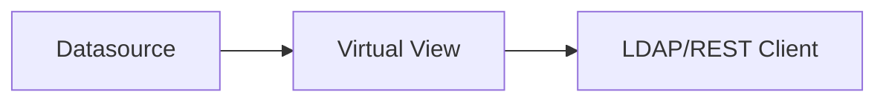
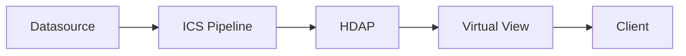
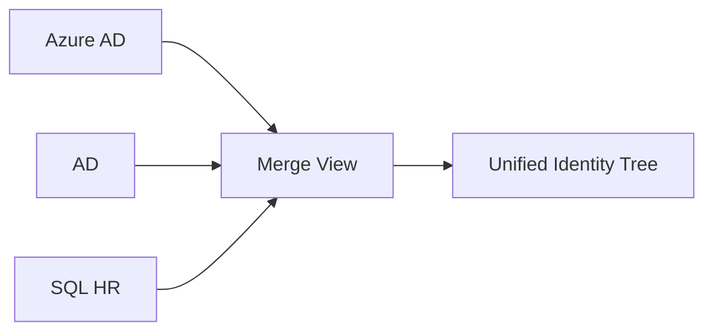

# RadiantOne Architecture Overview  
**File:** /docs/architecture-overview.md  
**Version:** 1.0  
**Purpose:** Provide diagrams and explanations of the core RadiantOne architectural components: VDS, ICS, HDAP, connectors, and identity flow patterns used in modern identity aggregation.

---

# Table of Contents
1. [High-Level Architecture](#high-level-architecture)  
2. [VDS Architecture](#vds-architecture)  
3. [ICS Architecture](#ics-architecture)  
4. [HDAP Architecture](#hdap-architecture)  
5. [Azure AD Integration Pattern](#azure-ad-integration-pattern)  
6. [Identity Flow Examples](#identity-flow-examples)

---

# High-Level Architecture

RadiantOne consists of three core subsystems:

```

+----------------------------+
|  VDS (Virtual Directory)   |
+----------------------------+
|
▼
+----------------------------+
|  ICS (Sync Engine)         |
+----------------------------+
|
▼
+----------------------------+
|  HDAP (Directory Store)    |
+----------------------------+

````

- **VDS** virtualizes identity data across sources.  
- **ICS** materializes and synchronizes identity objects.  
- **HDAP** stores high-performance directory entries.

---

# VDS Architecture

VDS exposes normalized identity data through:

- Virtual Views  
- Join Views  
- Merge Views  
- Lenses  
- REST / SCIM / LDAP interfaces  

### Diagram

```mermaid
flowchart TD
    A[Datasource: AzureAD] --> C[Virtual View]
    B[Datasource: SQL HR] --> C
    C --> D[Join / Merge Logic]
    D --> E[LDAP / REST / SCIM]
````

VDS enables applications to query a unified identity directory without knowing where the data originates.

---

# ICS Architecture

ICS is RadiantOne’s data ingestion and synchronization engine.

### Diagram

```mermaid
flowchart TD
    A[Connector] --> B[Pipeline Read]
    B --> C[Transform / Projection]
    C --> D[Write to HDAP]
    D --> E[Materialized Directory]
```

ICS handles:

* Full imports
* Delta imports
* Schema normalization
* Attribute mapping
* Change detection

---

# HDAP Architecture

HDAP is RadiantOne’s embedded high-performance directory store.

### Characteristics

* Distributed NoSQL-like directory
* Ideal for caching and large identity sets
* Supports persistent cache
* Fast read performance (~ms latency)

### Diagram

```mermaid
flowchart TD
    A[ICS Pipeline] --> B[HDAP Store]
    B --> C[Virtual View (Optional)]
    C --> D[Apps / Clients]
```

---

# Azure AD Integration Pattern

```mermaid
flowchart TD
    A[Azure AD (Microsoft Graph API)]
    B[Azure AD Datasource]
    C[Graph Connector]
    D[ICS Pipeline]
    E[HDAP Store]
    F[VDS Virtual View]
    
    A --> B --> C --> D --> E --> F
```

Steps:

1. Read Azure AD through Graph API
2. Sync via ICS pipeline
3. Materialize users in HDAP
4. Expose view through VDS

This pattern is used across cloud directory aggregation deployments.

---

# Identity Flow Examples

## **Flow 1 — Virtualization Only**



## **Flow 2 — Materialized Cache**



## **Flow 3 — Multi-Source Merge**



---

This document provides a conceptual understanding of RadiantOne and is meant to accompany labs and training materials.
